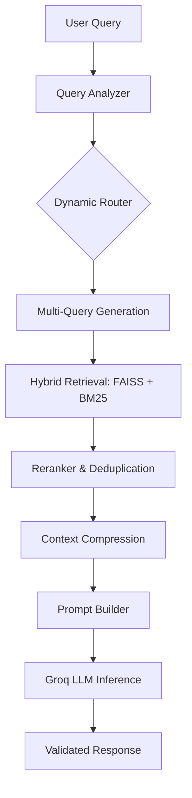

# ⚡ CodeFlux

[](https://opensource.org/licenses/MIT)
[](https://www.python.org/downloads/)
[](https://groq.com/)

**CodeFlux** is a production-grade Agentic AI coding assistant powered by advanced RAG (Retrieval-Augmented Generation) and context-aware reasoning. 

Unlike traditional "autocomplete" copilots, CodeFlux functions as a reasoning engine. It understands, debugs, and explains code by prioritizing a **retrieval-first architecture**, ensuring responses are grounded in actual documentation rather than relying solely on LLM internal memory.

---

## 🚀 Key Features

* **Agentic Reasoning:** Uses a dynamic pipeline to analyze queries before execution.
* **Hybrid Retrieval:** Combines **FAISS** (semantic search) and **BM25** (keyword search) with **Multi-Query expansion** for maximum recall.
* **Grounded Responses:** Root-cause analysis for debugging with zero-hallucination guarantees via RAG.
* **Context Optimization:** Features context compression and reranking to feed only the most relevant snippets to the LLM.
* **Language Aware:** Specialized filtering for Python, JavaScript, and TypeScript.
* **Modular Architecture:** Designed for production scalability with fallback mechanisms.

---

## 🏗️ Architecture

CodeFlux follows a sophisticated pipeline to ensure high-fidelity code generation and analysis:


## 🛠️ Tech Stack

* **Language:** Python
* **Vector Database:** FAISS
* **Embeddings:** Sentence Transformers (BGE models)
* **Inference:** Groq (Llama-3 / Mixtral)
* **Retrieval:** RankBM25 & Multi-Query Expansion
* **Orchestration:** Custom Agentic Pipeline

---

## 🚦 Getting Started

### Prerequisites

* Python 3.9 or higher
* A Groq API Key

### Installation

1. **Clone the repository:**
   ```bash
   git clone [https://github.com/your-username/codeflux-ai](https://github.com/your-username/codeflux-ai)
   cd codeflux-ai
   ```
2. **Setup virtual environment:**
   ```bash
   # Windows
   python -m venv .venv
   .venv\Scripts\activate
   
   # Mac/Linux
   python -m venv .venv
   source .venv/bin/activate
   ```
3. **Install dependencies:**
   ```bash
   pip install -r requirements.txt
   ```

### Configuration

Create a .env file in the root directory and add your API credentials:

GROQ_API_KEY=your_api_key_here

### 1. Ingest Documentation

Prepare your local knowledge base by indexing documentation:

python -m app.rag.ingest

### 2. Run the Pipeline

Test the assistant with a query:

python -m app.test_pipeline


## 📝 Example Output

**Input:** > "Why is my async code slow in Python?"

**Output:**

### 🔍 Explanation
**Root Cause:** You are likely using time.sleep() inside an async function. This is a blocking call that halts the entire event loop, preventing other tasks from running.

### ✅ Fix
Replace the synchronous time.sleep(n) with await asyncio.sleep(n).

### 💻 Code Example
import asyncio

async def foo():
    # Non-blocking sleep
    await asyncio.sleep(1)


## 📈 Roadmap

- [ ] **Backend:** FastAPI integration for RESTful access.
- [ ] **Frontend:** React-based UI featuring the Monaco Editor.
- [ ] **Memory:** Implementation of multi-turn conversation memory.
- [ ] **DevOps:** Dockerization and CI/CD cloud deployment.
- [ ] **Observability:** Integrated tracing (LangSmith/Arize).

## 💡 Why CodeFlux?

Most AI coding tools are "black boxes" that guess the next token. **CodeFlux is different.** It behaves like a senior engineer:

1. It **retrieves** relevant context first.
2. It **reasons** about the specific environment.
3. It **generates** code only after grounding itself in facts.

## 👨‍💻 Author

**Aditya Verma**


